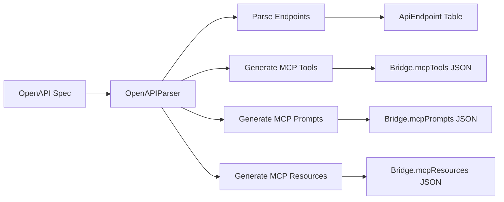

# MCP Bridge Data Architecture

This document explains the data architecture and flow for the MCP Bridge application, clarifying how REST API endpoints are transformed into MCP tools, prompts, and resources.

## Architecture Overview

The MCP Bridge uses a **hybrid data storage approach** that combines relational tables for source data with JSON fields for generated protocol data.

### Core Principle

- **Source Data**: Normalized in relational tables (ApiEndpoint, Bridge)
- **Generated Protocol Data**: Denormalized in JSON fields (mcpTools, mcpPrompts, mcpResources)

## Data Models

### 1. Bridge Table (Main Entity)

```sql
CREATE TABLE Bridge (
    id String PRIMARY KEY
    userId String
    name String
    slug String UNIQUE           -- UUID for routing
    description String
    baseUrl String

    -- Configuration as JSON
    authConfig Json              -- Authentication for source API
    headers Json                 -- Custom headers for source API
    routingConfig Json           -- MCP routing configuration
    accessConfig Json            -- Access control settings
    performanceConfig Json       -- Timeout, retry settings

    -- MCP Protocol Data (Generated Content)
    mcpTools Json               -- Array of MCP tool definitions
    mcpPrompts Json             -- Array of MCP prompt templates
    mcpResources Json           -- Array of MCP resource definitions

    enabled Boolean
    status BridgeStatus
    createdAt DateTime
    updatedAt DateTime
)
```

### 2. ApiEndpoint Table (Source API Endpoints)

```sql
CREATE TABLE ApiEndpoint (
    id String PRIMARY KEY
    bridgeId String             -- Foreign key to Bridge
    name String                 -- Endpoint identifier
    method HttpMethod           -- GET, POST, PUT, DELETE, PATCH
    path String                 -- API path like /posts/{id}
    description String
    config Json                 -- { parameters: [], requestBody: {}, responseSchema: {} }
)
```

### 3. AccessToken Table (Authentication)

```sql
CREATE TABLE AccessToken (
    id String PRIMARY KEY
    bridgeId String             -- Foreign key to Bridge
    token String UNIQUE
    name String
    permissions Json            -- Permission configuration
    isActive Boolean
    expiresAt DateTime
)
```

## Data Flow and Transformations

### 1. OpenAPI Import Flow



**Step-by-step process:**

```typescript
// 1. Parse OpenAPI specification
const result = OpenAPIParser.parseFromObject(openApiSpec);

// 2. Extract source API endpoints
const endpoints = result.data.endpoints;
// → Stored in ApiEndpoint table

// 3. Generate MCP protocol content
const mcpTools = result.data.mcpTools; // Generated from endpoints
const mcpPrompts = result.data.mcpPrompts; // Generated workflow templates
const mcpResources = result.data.mcpResources; // Generated documentation

// 4. Save to database
await BridgeService.createBridge({
  apiConfig: { endpoints }, // → Relational data
  mcpTools, // → JSON field
  mcpPrompts, // → JSON field
  mcpResources, // → JSON field
});
```

### 2. Runtime MCP Server Flow


**Step-by-step process:**

```typescript
// 1. MCP client requests available tools
const bridge = await BridgeService.getBridgeById(bridgeId);
const tools = bridge.mcpTools; // From JSON field
return { tools };

// 2. MCP client invokes a tool
const toolName = request.params.name;
const toolDef = bridge.mcpTools.find((t) => t.name === toolName);

// 3. Map to source API endpoint
const endpoint = bridge.apiConfig.endpoints.find((e) => e.name === toolName);

// 4. Execute API call
const response = await fetch(`${bridge.baseUrl}${endpoint.path}`, {
  method: endpoint.method,
  headers: bridge.authConfig,
  body: transformMcpInputToApiInput(request.params.arguments),
});
```

## Data Transformation Examples

### REST Endpoint → MCP Tool

**Source API Endpoint:**

```json
{
  "id": "endpoint-1",
  "name": "getAllPosts",
  "method": "GET",
  "path": "/posts",
  "description": "Retrieve all posts",
  "parameters": [{ "name": "limit", "type": "number", "required": false }]
}
```

**Generated MCP Tool:**

```json
{
  "name": "get_all_posts",
  "description": "Retrieve all posts from the API",
  "inputSchema": {
    "type": "object",
    "properties": {
      "limit": {
        "type": "number",
        "description": "Maximum number of posts to return"
      }
    }
  }
}
```

### OpenAPI Operations → MCP Prompts

**Source Operations:**

- `GET /posts` (list posts)
- `POST /posts` (create post)
- `DELETE /posts/{id}` (delete post)

**Generated MCP Prompts:**

```json
[
  {
    "name": "query_posts_data",
    "description": "Query and retrieve posts data from the API",
    "arguments": [
      { "name": "operation", "required": true },
      { "name": "parameters", "required": false }
    ]
  },
  {
    "name": "manage_posts_data",
    "description": "Create or modify posts data via the API",
    "arguments": [
      { "name": "operation", "required": true },
      { "name": "data", "required": false }
    ]
  }
]
```

### API Documentation → MCP Resources

**Generated MCP Resources:**

```json
[
  {
    "uri": "openapi://spec/full",
    "name": "Complete API Specification",
    "description": "Full OpenAPI specification for the API",
    "mimeType": "application/json"
  },
  {
    "uri": "openapi://endpoints/summary",
    "name": "API Endpoints Summary",
    "description": "Summary of all available endpoints",
    "mimeType": "text/markdown"
  }
]
```

## Architecture Benefits

### 1. Performance

- **Pre-generated MCP content** - No runtime generation overhead
- **Single query** - All MCP data loaded with bridge config
- **Efficient serialization** - JSON fields are optimized for read operations

### 2. Flexibility

- **Custom MCP schemas** - Can differ from source API structure
- **User modifications** - MCP tools can be customized without changing source endpoints
- **Protocol evolution** - MCP content can evolve independently

### 3. Consistency

- **Versioned together** - MCP content versioned with bridge configuration
- **Atomic updates** - Changes to bridge include all related MCP content
- **Data integrity** - Foreign key relationships maintained for source data

### 4. Scalability

- **Denormalized reads** - Fast MCP protocol responses
- **Normalized writes** - Efficient source data management
- **Separate concerns** - Source API vs. MCP protocol data

## File Structure

```
src/lib/
├── types.ts                 # TypeScript type definitions
├── bridge-service.ts        # Database operations and transformations
├── openapi-parser.ts        # OpenAPI → MCP content generation
└── contextlayer.ts          # MCP server runtime implementation

prisma/
└── schema.prisma           # Database schema definition

src/components/bridge-form/
├── BridgeForm.tsx          # Main form with MCP content handling
├── BasicInfoTab.tsx        # OpenAPI import and basic configuration
├── ResourcesTab.tsx        # MCP resources management
└── PromptsTab.tsx          # MCP prompts management
```

## Best Practices

### 1. Data Consistency

- Always update MCP content when source endpoints change
- Validate MCP schemas match source API capabilities
- Use transactions when updating both relational and JSON data

### 2. Performance Optimization

- Index JSON fields for frequently queried MCP content
- Use partial indexes on active bridges only
- Consider caching for frequently accessed bridge configurations

### 3. Migration Strategy

- Use database migrations for schema changes
- Implement data transformation scripts for existing bridges
- Maintain backward compatibility during protocol updates

### 4. Error Handling

- Validate JSON structure before database operations
- Provide fallback mechanisms for malformed MCP content
- Log transformation errors for debugging

This hybrid architecture provides the best of both worlds: the reliability and queryability of relational data for source information, with the flexibility and performance of JSON storage for generated protocol content.
